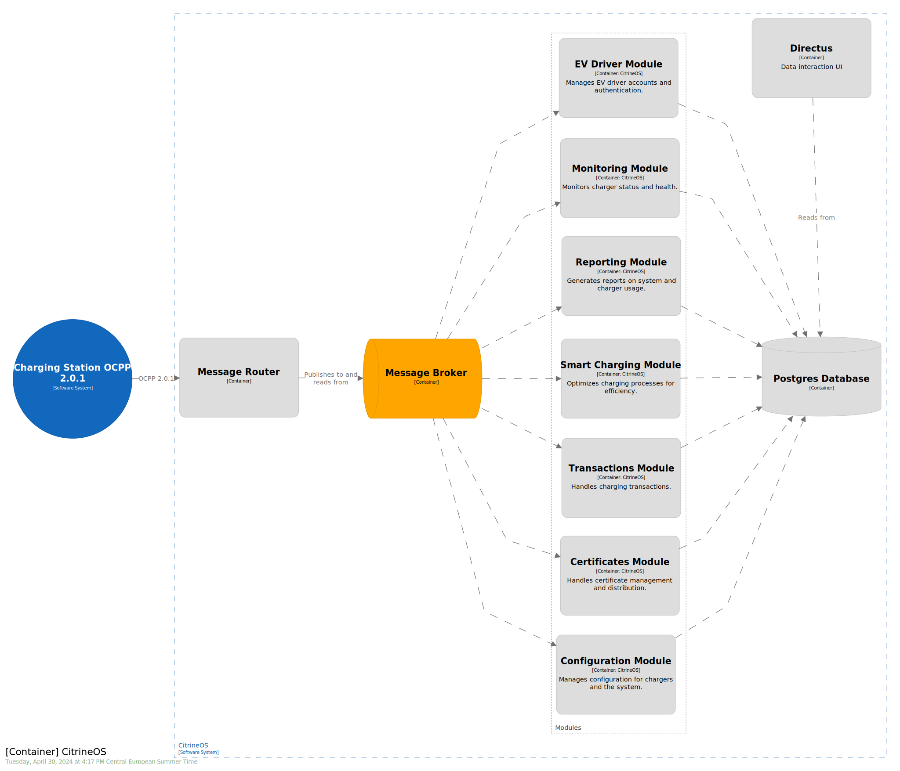

# Architecture

Citrine is an OCPP 2.0.1 Charging Station Management System (CSMS) designed to be adaptable to various infrastructures and easily extensible via modular design. It uses the [fastify](https://github.com/fastify/fastify) web framework.

Below is a diagram to introduce you to Citrine's high-level architecture:

> N.B.: In the diagram above the websocket connections pass through the cloud before touching the central system. 
> The definitions for the central system in 00_Base do not require direct websocket connectivity. 
> Use of an infrastructure layer between the websockets and central system, such as [AWS's API Gateway](https://docs.aws.amazon.com/apigateway/latest/developerguide/apigateway-websocket-api.html), is thus supported. 
> The implementation which lives in Server handles the websockets directly.

## Codebase Structure
Citrine's code structure includes 3 common packages: 00_Base, 01_Data, 02_Util and 03_Modules.

### 00_Base

00_Base defines the interfaces and abstract classes needed for the Module implementations, you can view this as setting the underlying structure that the modules will implement.
All OCPP messages and datatypes are here as well.

#### Decorators
We make use of custom decorators that define methodes to be used for specific logic use cases.

- `@AsHandler`:Defines a method as an OCPP call handler that listens for specific OCPP messages types from the message broker.
- `@AsMessageEndpoint`: Defines a method as a Fastify-exposed API endpoint that takes in HTTP requests that are sent to a charging station.
- `@AsDataEndpoint`: Defines a method as a Fastify-exposed API endpoint that exposes CRUD functionality for entities defined in the 01_Data package.

---

### 01_Data

01_Data implements all the logic for Citrine's persistent data, stored in a relational database. 
This package is powered by [sequelize-typescript](https://github.com/sequelize/sequelize-typescript). 
New modules which add persistent datatypes will need to extend this package.

--- 

### 02_Util

02_Util contains implementations of various infrastructure components and tools.

This includes:

- Cache implementations, such as [redis](https://github.com/redis/redis) and a simple Javascript in-memory cache
- Message broker implementations such as [google pubsub](https://github.com/googleapis/nodejs-pubsub), [kafka](https://github.com/tulios/kafkajs), and an AMPQP-compatible implementation using [amqlib](https://github.com/amqp-node/amqplib). 
- Network connection implementation such as websockets
- Swagger plugin for displaying API documentation for all endpoints exposed by Fastify.
- 
This module can be extended to add additional infrastructure options.

--- 

### 03_Modules

Citrine is set up that Modules have the actual implementations of OCPP Functional Blocks.
They pull in the other packages like 00_base, 01_Data, 02_Util and are built on top.

The structure for each module should be roughly the same, set up as:

- `api.ts`: Defines the API endpoints for the module
- `module.ts`: Hold the `@AsHandler` decorated methods that handle OCPP messages. Here you will also find the supported call actions listed in an array at the top.
- `service.ts`: Offers the deeper logic for the OCPP functional Blocks and is called by the methods in `module.ts`

#### Certificates

Is responsible for handling certificate management, especially relevant for ISO15118. Certificates are also used to maintain websocket and OTA firmware update security.

#### Configuration

Handles the configuration of the Charging Station. Example messages are `BootNotification` and `Reset`. 

#### EVDriver

Is responsible for handling driver related functionality, example messages are `Authorize` and `RequestStartTransaction`.

#### Monitoring

Is responsible for handling Monitoring related functionality. Example message are `NotifyEvent` and `SetVariables`.

#### OCPPRouter

The OCPP router handles the OCPP messages and routes them to and from the correct charger.
Furthermore, you can register callbacks for websocket events or specific OCPP messages to be executed in the future.

#### Reporting

Is responsible for handling Reporting related functionality. Example message are `SecurityEventNotification` and `GetBaseReport`.

#### SmartCharging

Is responsible for handling SmartCharging related functionality. Example message are `ReportChargingProfiles` and `SetChargingProfile`.

#### Transactions

Is responsible for handling Transaction related functionality. Example message are `TransactionEvent` and `CostUpdated`.

---

### Server

The server directory is an example implementation using the Citrine modules.
It is not designed for production use, but rather for local development and test environments.
Citrine is designed in a modular fashion scale each module independently.
If you want to just use it for local development, check out our guide here: [Getting Started](../getting-started/getting-started.md)

---

### Other Module Examples

Outside of the OCPP 2.0.1 protocol, modules could do things like [provide OCPI interfaces](https://github.com/citrineos/citrineos-ocpi), feed data to analysis tools, [handle payments](https://github.com/citrineos/citrineos-payment), or more.

---

