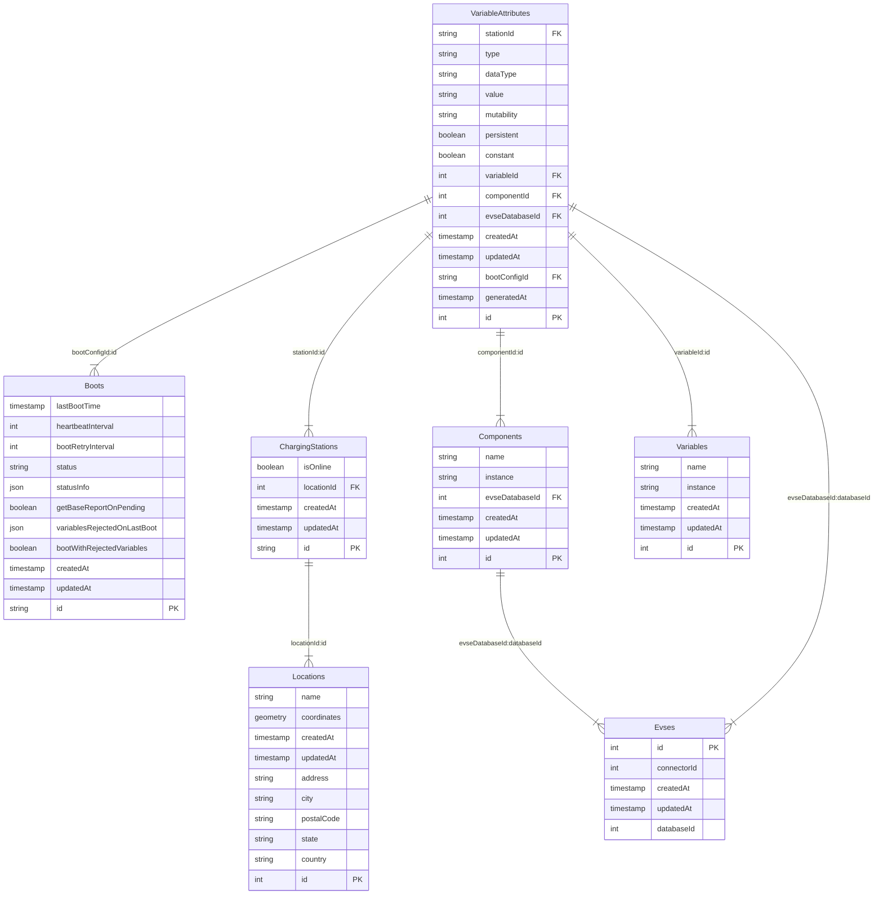
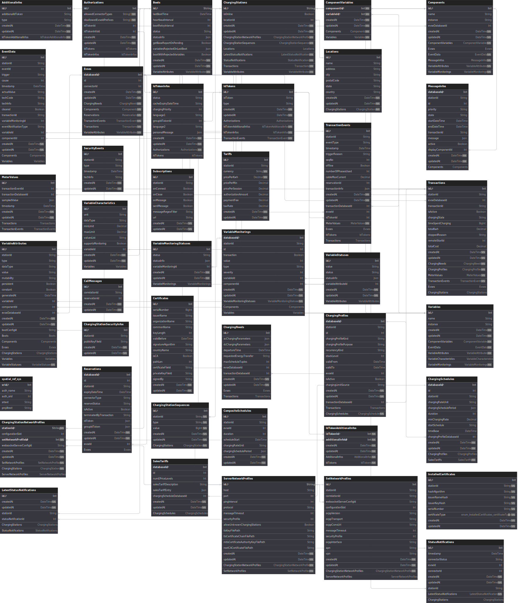

Our current implementation uses a relational database (Postgres).

A key data model in OCPP 2.0.1 is the device model.
In our case we modeled the database after what is returned by the charger when it gives us the base report. 
Here is a diagram showing how the data is related.

Here is an entity relation diagram showing all the tables. 

