This page focuses on the relationships between the database entities. For information about their attributes, you can find 
them in `citrineos-core/packages/dal`.

Note that entities may appear more than once in the diagrams, depending on how they relate to the categories below and 
the relationships described. 

# Tenants

`Tenants` represents all available tenants that CitrineOS recognizes. **Every model has a `tenantId` FK**, meaning
every model has a relationship to Tenants.

The one exception is **`ServerNetworkProfile.tenantId`**, where its `tenantId` is nullable since server profiles can exist
before a tenant is resolved (see `Websocket Server Configurations` -> `dynamicTenantResolution` in [configurations](../configuration)).

**Relevant Tables**:

All of the tables.

# Locations, Charging Stations, EVSEs, & Connectors

`Location` holds a pool of `ChargingStation`s; each station exposes `Evse`s; each `Evse` exposes `Connector`s. 
`StatusNotification` is the append-only connector-status log, with `LatestStatusNotification` as a pointer to the newest 
row per station.

Note that `Evse` is the physical/persistent EVSE record owned by a station, while `EvseType` is the OCPP 2.0.1 `EVSEType` 
message  component (an `{id, connectorId}` pair) used inside requests — it lives in the *device model* cluster and is referenced
by `Reservation`, `TransactionEvent`, `Component` and `VariableAttribute`. They are **not** the same table.

**Relevant Tables**

1. Boot
2. ChargingStationSecurityInfos
3. ChargingStationSequences
4. ChargingStations
5. Connectors
6. Evses
7. EvseTypes
8. LatestStatusNotifications
9. Locations
10. StatusNotifications

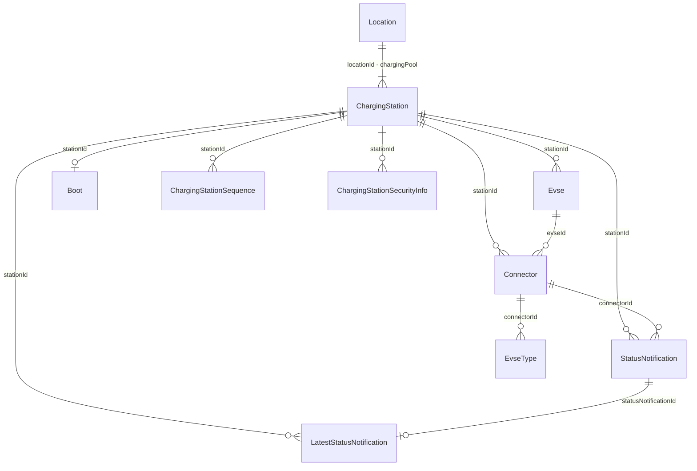

## Certificates

`Certificate` is the CSMS-side certificate store (self-referencing to model a signing chain). `InstalledCertificate`
mirrors what the station reports as installed; the two `*Attempt` tables log install/delete requests.

**Relevant Tables**

1. Certificates
2. ChargingStations
3. DeleteCertificateAttempts
4. InstallCertificateAttempts
5. InstalledCertificates

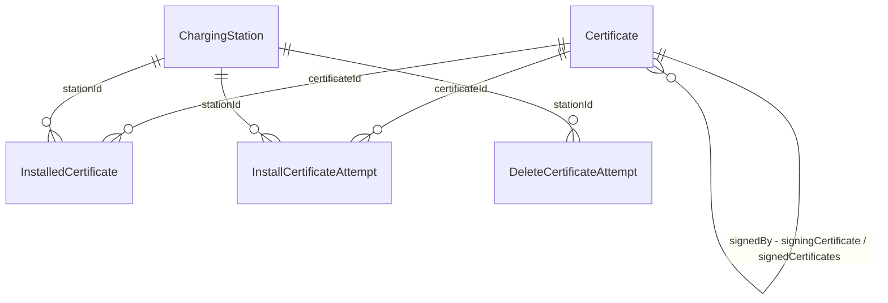

## Security

**Relevant Tables**

1. ChargingStations
2. ChargingStationSecurityInfos
3. SecurityEvents

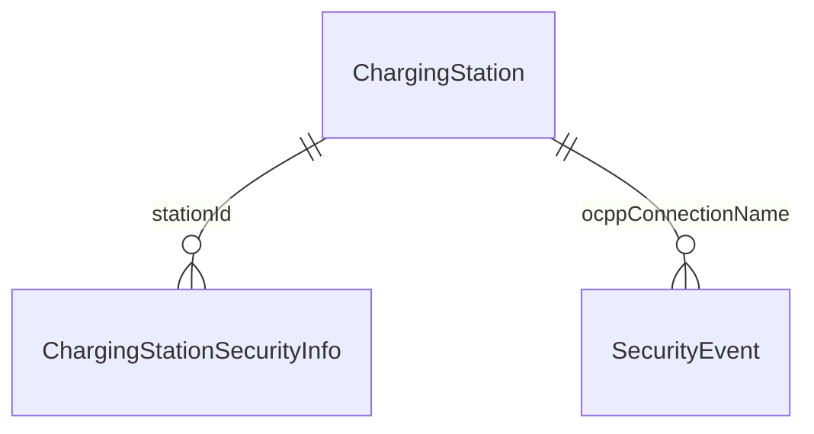

## Network Profiles & Connectivity

`ServerNetworkProfile` describes a CSMS websocket endpoint; `SetNetworkProfile` records a `SetNetworkProfile` request 
sent to a station; `ChargingStationNetworkProfile` is the join table binding a station's configuration slot to both.

**Relevant Tables**

1. ChargingStationNetworkProfiles
2. ChargingStations
3. ServerNetworkProfiles
4. SetNetworkProfiles

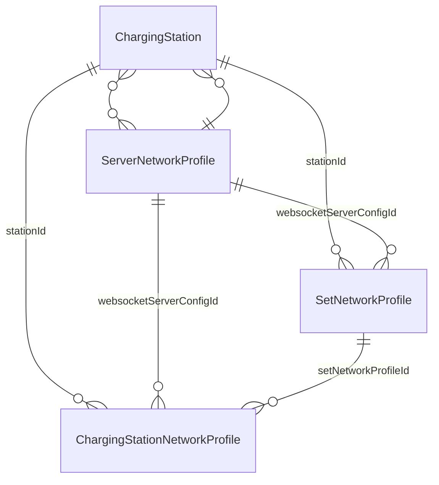

## Messaging, Reservations, and Operations

**Relevant Tables**

1. AsyncJobStatuses
2. ChangeConfigurations
3. ChargingStations
4. Components
5. EvseTypes
6. MessageInfos
7. OCPPMessages
8. Reservations
9. SecurityEvents
10. Subscriptions
11. TenantPartners
12. Tenants

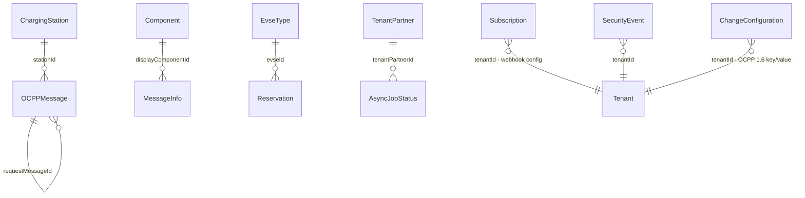

# Device Model (OCPP 2.x)

The OCPP 2.x component/variable tree. `Component` x `Variable` is many-to-many through `ComponentVariable`; a concrete 
reported value is a `VariableAttribute` (scoped to a station, component, variable and attribute type), and `VariableStatus` 
is the per-attribute set/change result log.

**Relevant Tables**

1. Boots
2. ChargingStations
3. Components
4. ComponentVariables
5. EvseTypes
6. MessageInfos
7. VariableAttributes
8. VariableCharacteristics
9. VariableStatuses
10. Variables

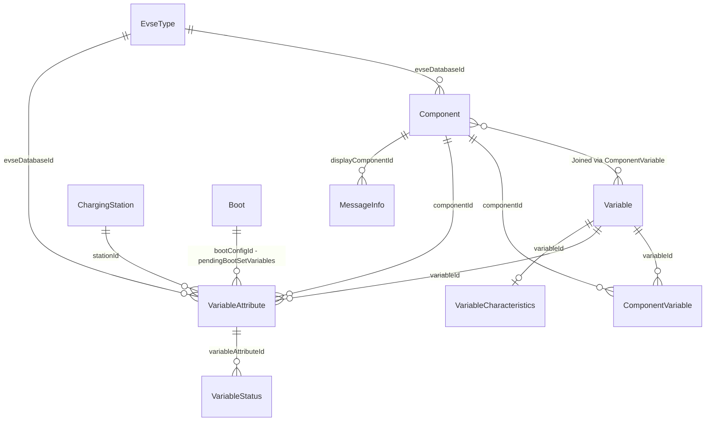

## Variable Monitoring & Events

`VariableMonitoring` is a monitor configured on a component/variable at a station; `VariableMonitoringStatus` logs 
set/clear results; `EventData` is the inbound `NotifyEvent` payload.

**Relevant Tables**

1. ChargingStations
2. Components
3. EventData
4. VariableMonitoringStatuses
5. VariableMonitorings
6. Variables

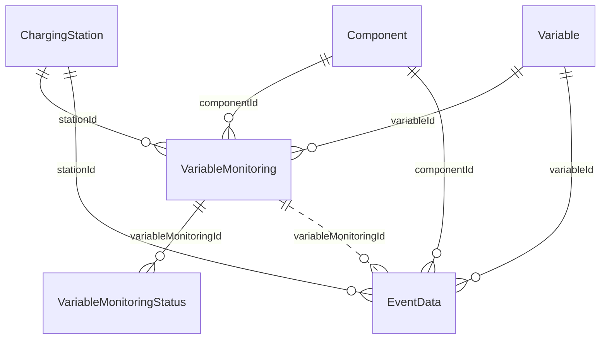

# Transactions & Metering

`Transaction` is the main entity holding transaction information. OCPP 2.0.1 supplements it via `TransactionEvent`; 
OCPP 1.6 supplements it via `StartTransaction` / `StopTransaction`. `MeterValue` attaches to whichever of the three is relevant.

**Relevant Tables**

1. Authorizations
2. ChargingNeeds
3. ChargingStations
4. Connectors
5. Evses
6. EvseTypes
7. Locations
8. MeterValues
9. StartTransactions
10. StopTransactions
11. Tariff
12. TransactionEvents
13. Transactions

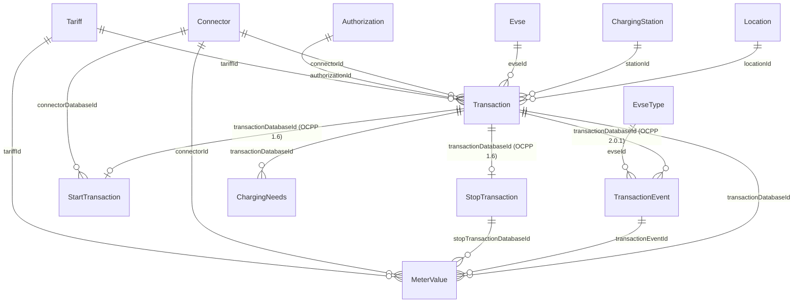

##  Authorizations

`Authorization` represents ID Tokens. The `LocalList*` family is a separate, parallel copy used to build and version the 
station-side local authorization list — it deliberately does **not** reuse `Authorization` rows.

**Relevant Tables**

1. Authorizations
2. LocalListAuthorizations
3. LocalListVersionAuthorizations
4. LocalListVersions
5. SendLocalListAuthorizations
6. SendLocalLists
7. Tariffs
8. TenantPartners
9. Transactions

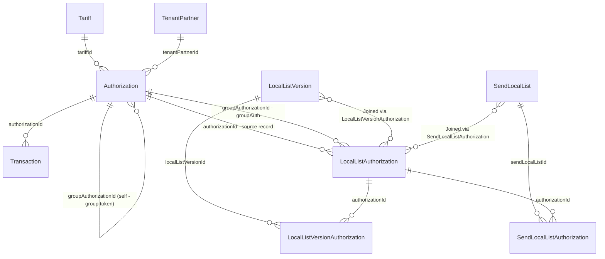

## Tariffs

`Tariff` represents a pricing tariff.

Note that `SalesTariff` in Smart Charging is unrelated — it is the OCPP ISO 15118 `SalesTariff` element attached
to a charging schedule, not a pricing record.

**Relevant Tables**

1. Authorizations
2. Connectors
3. MeterValues
4. Tariffs
5. Transactions

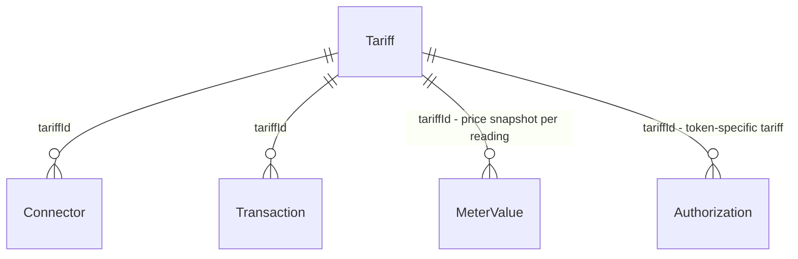

# Smart Charging

`ChargingProfile` → `ChargingSchedule` → `SalesTariff` is the OCPP profile tree. `ChargingNeeds` captures `NotifyEVChargingNeeds`;
`CompositeSchedule` stores a computed `GetCompositeSchedule` result.

**Relevant Tables**

1. ChargingNeeds
2. ChargingProfiles
3. ChargingSchedules
4. CompositeSchedules
5. Evses
6. Transactions

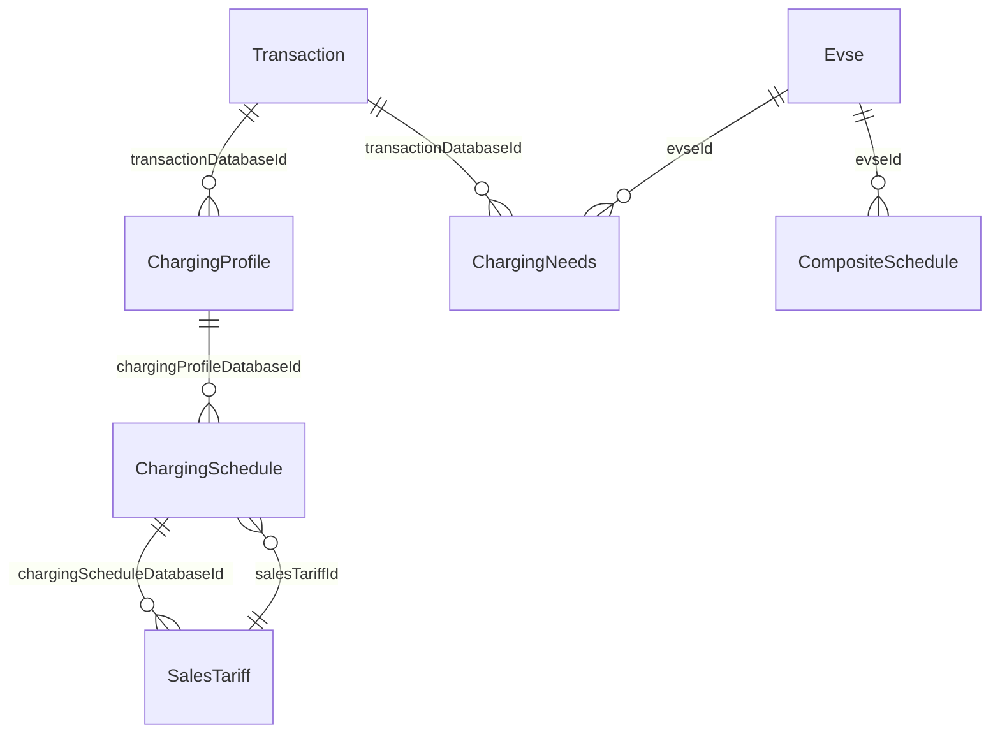

# Pure OCPP 1.6 vs 2.x models

## **1.6-only** 
- `ChangeConfiguration`
- `Connector`
- `StartTransaction`
- `StopTransaction`
## **2.x-only** 
- `ChargingNeeds`
- `Component`
- `EventData`
- `EvseType`
- `InstalledCertificate`
- `LocalListVersion`
- `MessageInfo`
- `SalesTariff`
- `SendLocalList`
- `SetNetworkProfile`
- `TransactionEvent`
- `Variable`
- `VariableAttribute`
- `VariableCharacteristics`
- `VariableMonitoring`
- `VariableMonitoringStatus`
- `VariableStatus`
## **Shared** 
- `Authorization`
- `Boot`
- `ChargingProfile`
- `ChargingSchedule`
- `ChargingStation`
- `MeterValue`
- `OCPPMessage`
- `Reservation`
- `StatusNotification`
- `Transaction`